  

 

### About

Computer Science (Data Science) undergraduate at ABES Institute of Technology, working at the intersection of **Generative AI** and **cybersecurity**, and building my foundations in **machine learning**. I've completed a cybersecurity internship that included vulnerability assessments of client networks, competed in **Smart India Hackathon 2025 and 2026**, and hold certifications from Google, Cisco, IBM and Infosys refering to my core Technical skills.

### Core focus

### Toolkit

| Area | Tools |
|---|---|
| **Generative AI** |     |
| **Security** |        |
| **AI / ML** |    |
| **Languages** |        |
| **Web** |       |
| **Tools** |    |

### Selected work

| Project | Focus | Summary | Stack |
|---|---|---|---|
| **[Xena AI Assistant](https://github.com/rubivssingh281-lab/Xena-AI-Assistant)** | Gen-AI | Voice-controlled assistant that runs system commands from natural language, averaging under 1 s per response | Python · SpeechRecognition · pyttsx3 |
| **[Web ID Changer](https://github.com/rubivssingh281-lab/Web-ID-Changer-for-Kali-Linux)** | Security | Spoofs MAC addresses and browser fingerprints for anonymity during authorised penetration tests | Python · Bash · Kali Linux |
| **[Ediglobe Secure](https://github.com/rubivssingh281-lab/MajorProjectEdiglobe)** | Security | Authentication system with bcrypt, rate limiting, XSS sanitisation, audit logging and account lockout | Node.js · Express · MySQL |
| **[GeoSat](https://github.com/rubivssingh281-lab/GeoSat)** | AI / ML | SAR-to-optical satellite image retrieval with a dual-encoder ResNet18 (InfoNCE loss) behind a Flask API | PyTorch · Torchvision · Flask |
| **[Bhu-Darpan](https://github.com/rubivssingh281-lab/Bhu-Darpan)** | AI / ML | Satellite analysis for land-cover mapping, object detection and change tracking, with PDF reporting | U-Net · SegFormer · YOLOv11 |

### Experience

**Cybersecurity Intern**, Ediglobe India · *Feb – Mar 2026* 
Performed internal and external vulnerability assessments on client networks, identifying 15+ critical issues. Validated findings with Metasploit and Burp Suite and delivered remediation reports to IT leads.

**Web Development Intern**, Vault of Codes · *Jun – Aug 2026* 
Built a climate-risk dashboard delivering live weather alerts to farmers and a photoshoot booking site for a real studio client, a personal portfolio.

### Certifications

12 certifications · Google, Cisco, IBM, Infosys

 

| Area | Certification | Issuer |
|---|---|---|
| Generative AI | Introduction to Generative AI | Google |
| Generative AI | Prompt Design in Vertex AI (skill badge) | Google |
| Generative AI | Build an AI Agent | IBM |
| Generative AI | Agentic AI Practitioner | AgentSwarms / Agentic AI Lab |
| Security | Google Cloud Cybersecurity | Google |
| Security | Ethical Hacker | Cisco |
| Security | Cybersecurity | Cisco |
| Security | Cybersecurity Fundamentals | IBM |
| Development | Python Developer | Infosys |
| Development | Java Developer | Infosys |
| Development | CI/CD – DevOps | Infosys |
| Development | Web Development Fundamentals | IBM |

### Activity

  

<picture>
  <source media="(prefers-color-scheme: dark)" srcset="https://raw.githubusercontent.com/rubivssingh281-lab/rubivssingh281-lab/output/github-snake-dark.svg"/>
  <source media="(prefers-color-scheme: light)" srcset="https://raw.githubusercontent.com/rubivssingh281-lab/rubivssingh281-lab/output/github-snake.svg"/>
  
</picture>

 

